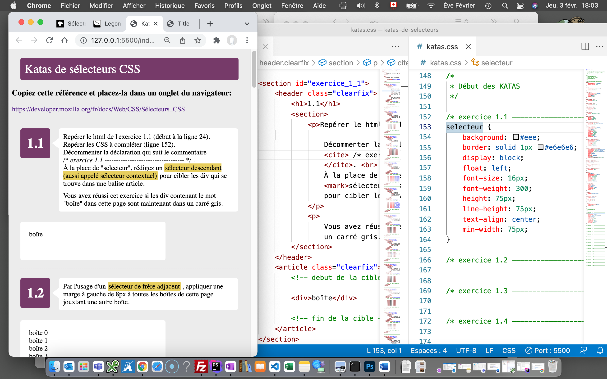

# Katas de sélecteurs

Pour faire ces exercices vous pouvez vous placer soit dans CodePen ou encore dans VSCode. Suivre les consignes ci-dessous selon le choix. 

## Dans les 2 cas, placer dans des onglets du navigateur pour consulter au fur et à la mesure:  

1. la référence des sélecteurs sur MDN  
https://developer.mozilla.org/fr/docs/Web/CSS/Sélecteurs_CSS  
2. **le fichier des résultats attendus**
dans le dossier images/***resultats-attendus-screencapture.png***

## Dans CodePen
Katas de sélecteurs - __départ__  
https://codepen.io/evefevrier/pen/mdjGOwB 

Katas de sélecteurs - __url codepen final__
*PLACER ICI L'URL DE VOTRE CODEPEN*

## Dans VSCode
Visionner le résultat en envoyant la page index.html dans le navigateur grâce à l'extension ***Live Server***.
Travailler dans le fichier css et observer les résultats à chaque sauvegarde.

